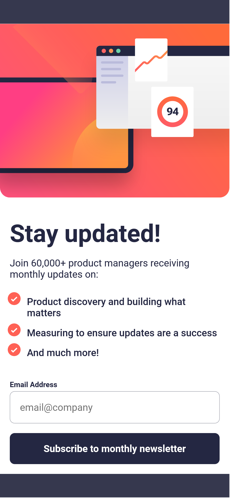

# Frontend Mentor - Newsletter sign-up form with success message solution

This is a solution to the [Newsletter sign-up form with success message challenge on Frontend Mentor](https://www.frontendmentor.io/challenges/newsletter-signup-form-with-success-message-3FC1AZbNrv). Frontend Mentor challenges help you improve your coding skills by building realistic projects.

## Table of contents

- [Overview](#overview)
  - [The challenge](#the-challenge)
  - [Screenshots](#screenshots)
  - [Links](#links)
- [My process](#my-process)
  - [Built with](#built-with)
  - [What I learned](#what-i-learned)
  - [Continued development](#continued-development)
- [Author](#author)

## Overview

### The challenge

Users should be able to:

- Add their email and submit the form
- See a success message with their email after successfully submitting the form
- See form validation messages if:
  - The field is left empty
  - The email address is not formatted correctly
- View the optimal layout for the interface depending on their device's screen size
- See hover and focus states for all interactive elements on the page

### Screenshots


Screenshot in Desktop (1440px) viewport


<br/>
Screenshot in Mobile (375px) viewport

### Links

- Solution URL: [Add solution URL here](https://your-solution-url.com)
- Live Site URL: [Add live site URL here](https://2g2-99.github.io/newsletter_sign-up/)

## My process

### Built with

- Semantic HTML5 markup
- CSS custom properties
- Flexbox
- Responsive Grid layout
- [React](https://reactjs.org/) - JS library
- [Vite](https://vitejs.dev/) - Front-end tool

### What I learned

In this challenge, I have had the opportunity to practice adapting to design changes to meet client requirements.

Here are some pieces of code that I used to work with the value of the input and to control which component is being displayed.

```js
  const [submitted, setSubmitted] = useState(false);
  const [email, setEmail] = useState('');
  const handleSubmit = (emailValue, isValid) => {
    if (isValid) {
      setTimeout(() => {
        setEmail(emailValue);
        setSubmitted(true);
      }, 250);
    } else {
      return;
    }
  };

  return (
    {submitted === false ? (
          <SignUp onSubmit={handleSubmit} />
        ) : (
          <Success onClick={handleDismiss} userEmail={email} />
        )}
  )

```

### Continued development

I have realised that while the responsive Grid layout I have implemented to replace the standard containers and breakpoints is helpful, it is not flawless. In certain situations, it may require some experimentation and workaround. However, as a developer, it is common to encounter such challenges frequently, and it is crucial to be adaptable and find alternative solutions.

## Author

- Website - [Santiago Gomez](https://santiago-gomez.netlify.app/)
- Frontend Mentor - [@2G2-99](https://www.frontendmentor.io/profile/2G2-99)
